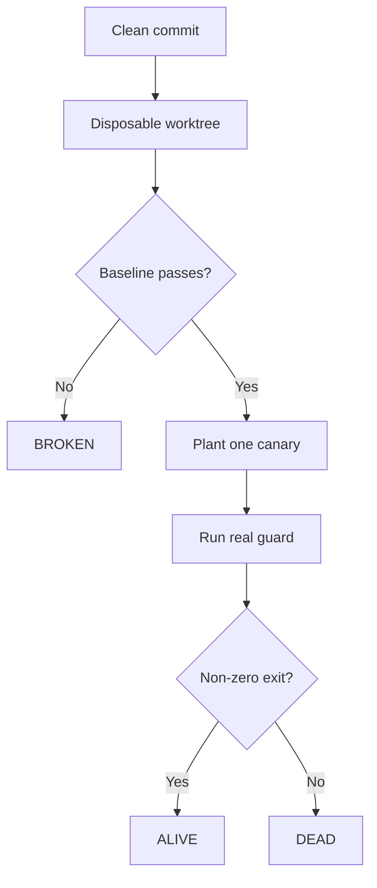

<p align="center">
  
</p>

<h1 align="center">RuleTrip</h1>

<p align="center"><strong>Mutation testing for repository guardrails.</strong><br>Prove your feedback controls trip before trusting a green build.</p>

<p align="center">
  <a href="https://github.com/Dean00dev/RuleTrip/actions/workflows/ci.yml"></a>
  <a href="LICENSE"></a>
  
  
</p>

Your tests pass. Your linter passes. Your policy scanner passes. But would any of them notice the failure they exist to catch?

RuleTrip answers that narrower, harder question by planting a controlled violation in a disposable Git worktree and running the real guard command. If the command still exits zero, the guard is **DEAD** for that canary—even though CI was green.

```text
[baseline] Node test discovery
[canary]   A deliberately failing test is discovered

RuleTrip: ALIVE | alive 1 | dead 0 | broken 0 | inconclusive 0
```

## Why this is different

Static configuration auditors inspect what a harness *says* it runs. Coverage tools inspect what tests execute. Agent evaluations inspect an agent's output. RuleTrip dynamically asks whether a repository's existing feedback control rejects a known-bad state.

| Tool class | Question |
| --- | --- |
| Static harness audit | Is the configuration shaped correctly? |
| Code coverage | Which code did tests execute? |
| Agent evaluation | Did the agent complete the task? |
| **RuleTrip** | **Did the configured guard actually reject this planted violation?** |

RuleTrip is model-agnostic. It needs no API key, model, network service, or telemetry endpoint.

## How it works



Every canary gets a fresh detached worktree. RuleTrip applies only declarative file mutations; it does not apply model-generated patches or mutate the checked-out commit.

## Outcomes

| Outcome | Meaning |
| --- | --- |
| **ALIVE** | The configured command rejected that exact planted violation. |
| **DEAD** | The configured command returned zero after the violation. This is a false green. |
| **BROKEN** | The command already failed on the clean baseline, so the experiment has no valid control. |
| **INCONCLUSIVE** | A timeout, mutation error, or infrastructure problem prevented safe classification. |

An **ALIVE** result is deliberately modest: it does not certify correctness, security, coverage, or the quality of the guard. It proves one observable response to one declared canary at one commit.

## Quick start

RuleTrip requires Node.js 20+ and Git.

```bash
npm install --save-dev github:Dean00dev/RuleTrip#v0.1.0
npx ruletrip init
npx ruletrip run
```

`ruletrip init` detects an existing `npm test` script and creates a starter `.ruletrip.json`. Review that file—the command and canary are executable policy, not magic defaults.

### Minimal configuration

```json
{
  "version": 1,
  "guards": [
    {
      "id": "tests",
      "name": "Test discovery",
      "command": "npm test",
      "canaries": [
        {
          "id": "failing-test",
          "name": "A deliberately failing test is discovered",
          "type": "create",
          "path": "test/ruletrip-canary.test.js",
          "content": "import test from 'node:test';\nimport assert from 'node:assert/strict';\ntest('RuleTrip canary', () => assert.fail('RULETRIP_CANARY'));\n"
        }
      ]
    }
  ]
}
```

The baseline must exit `0`. The same command then runs against each fresh mutation. A non-zero canary run is **ALIVE**; a zero canary run is **DEAD**.

## GitHub Action

```yaml
name: Harness canaries

on:
  pull_request:
  push:
    branches: [main]

permissions:
  contents: read

jobs:
  ruletrip:
    runs-on: ubuntu-latest
    steps:
      - uses: actions/checkout@v7
        with:
          persist-credentials: false

      - uses: actions/setup-node@v7
        with:
          node-version: 24

      - run: npm ci

      - uses: Dean00dev/RuleTrip@v0.1.0
        with:
          fail_on: dead,broken,inconclusive
```

For the strongest supply-chain binding, replace version tags—including RuleTrip's—with full commit SHAs. The repository's own workflow does this.

RuleTrip refuses to run under `pull_request_target`. Repository commands and `.ruletrip.json` are trusted code; running a fork's version with privileged secrets would be unsafe.

## Declarative canaries

| Type | Required fields | Behaviour |
| --- | --- | --- |
| `create` | `path`, `content` | Creates a new file; refuses overwrite by default. |
| `append` | `path`, `content` | Appends controlled text to a file. |
| `replace` | `path`, `search`, `replacement` | Replaces an exact string; fails inconclusively if absent. |
| `delete` | `path` | Deletes a file in the disposable worktree. |

Paths must remain inside the worktree, cannot target `.git`, and cannot cross a symlink into a shared external directory. See [Configuration](docs/CONFIGURATION.md) for every field and examples for tests, type checks, lint rules, unpinned Actions, forbidden files, and synthetic secret canaries.

## Reports

Each run writes:

- `ruletrip-summary.md` — human-readable experiment table;
- `ruletrip-report.json` — machine-readable evidence;
- `ruletrip-results.sarif` — findings for code-scanning consumers.

The Action also writes the Markdown report to the GitHub job summary and exposes counts and report paths as outputs. Command stdout/stderr is excluded from persisted reports by default to reduce accidental secret leakage.

## Security boundary

RuleTrip's mutation engine operates on disposable worktrees. It is **not** an operating-system sandbox:

- configured guard commands are trusted and can do anything the runner identity permits;
- optional `linkPaths` are shared with the source checkout and should be treated as writable by guard commands;
- use minimal workflow permissions and do not provide secrets to untrusted pull requests;
- synthetic secret canaries must be inert test strings, never real credentials;
- RuleTrip never uploads source or calls a model/service itself.

Read the full [Threat Model](docs/THREAT_MODEL.md) before using RuleTrip in privileged CI.

## Current limits

- Git worktrees require a repository with at least one commit.
- RuleTrip measures process exit behaviour, not semantic correctness.
- A poorly chosen canary can produce a misleading **ALIVE** result.
- Shared dependency paths trade isolation for speed.
- v0.1 runs experiments sequentially and supports file mutations only.

These are product boundaries, not hidden caveats. See [Design](docs/DESIGN.md) for the reasoning and [Roadmap](docs/ROADMAP.md) for planned work.

## Contributing

Canary presets, hostile fixtures, cross-platform reports, and falsification cases are welcome. Start with [CONTRIBUTING.md](CONTRIBUTING.md). Security reports belong in [SECURITY.md](SECURITY.md), not public issues.

## License

[MIT](LICENSE) © 2026 Dean Egan.
