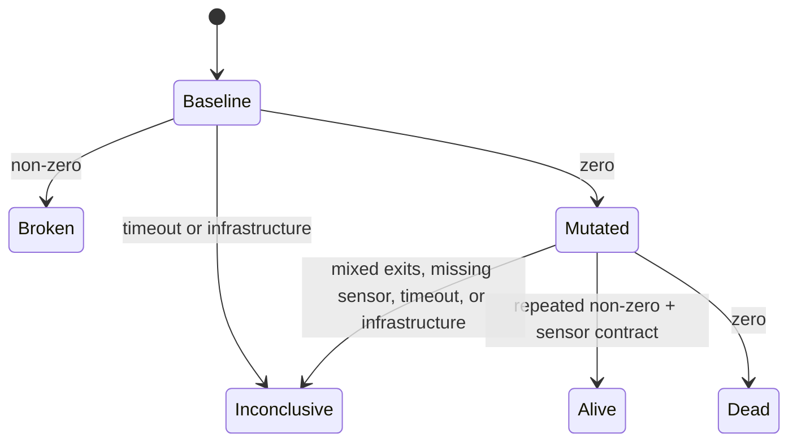

# Design

## Experiment contract

Every guard follows a controlled sequence:

1. Resolve the current commit.
2. Create a detached worktree.
3. Run the guard unchanged as a clean control for the configured number of confirmations.
4. If the control passes, create a new worktree for each canary.
5. Apply exactly one declarative mutation.
6. Run the same guard command in one or more fresh confirmation worktrees.
7. If configured, require the declared literal sensor to be absent on bounded clean controls and present on bounded mutation output.
8. Classify the repeated exit behaviour and sensor observation, then destroy every worktree.

This avoids three misleading shortcuts:

- a failing baseline cannot masquerade as canary detection;
- one canary cannot contaminate the next;
- mutation failures cannot be counted as guard successes.

## State model

## Why declarative mutations

Arbitrary mutation scripts would be flexible but difficult to audit and easy to mistake for the guard itself. v0.1 supports four bounded file operations. The guard command remains arbitrary because repositories already express their checks through language-specific commands.

## Why JSON

JSON allows strict parsing with the Node.js standard library and introduces no runtime supply-chain dependency. Schema versioning provides an explicit compatibility boundary.

## Why worktrees

Worktrees preserve the exact committed repository without copying every tracked file, work on all major Git platforms, and make cleanup observable through Git. They are file-state isolation, not process isolation; the threat model makes that boundary explicit.

## Why output is not evidence by default

Guard output can contain source fragments, environment details, or secrets. v0.1 records exit code, signal, timing, timeout, and truncation facts while leaving raw stdout/stderr out of reports. Debug the guard directly when classification needs investigation.

v0.3 permits a narrower use of output: a user-declared literal sensor can be matched in memory against bounded stdout, stderr, or both. Attribution requires a differential observation—absent on every clean control and present on every mutation run. Reports retain only stream, truncation, and match facts. This improves attribution without turning arbitrary logs into stored evidence.

## Why confirmation is unanimity, not voting

Repeated experiments are designed to reveal instability, not hide it. Every clean baseline must pass and every mutated attempt must agree. A mixed result is **INCONCLUSIVE** even if most attempts agree, because majority voting would convert flakiness into false confidence.
